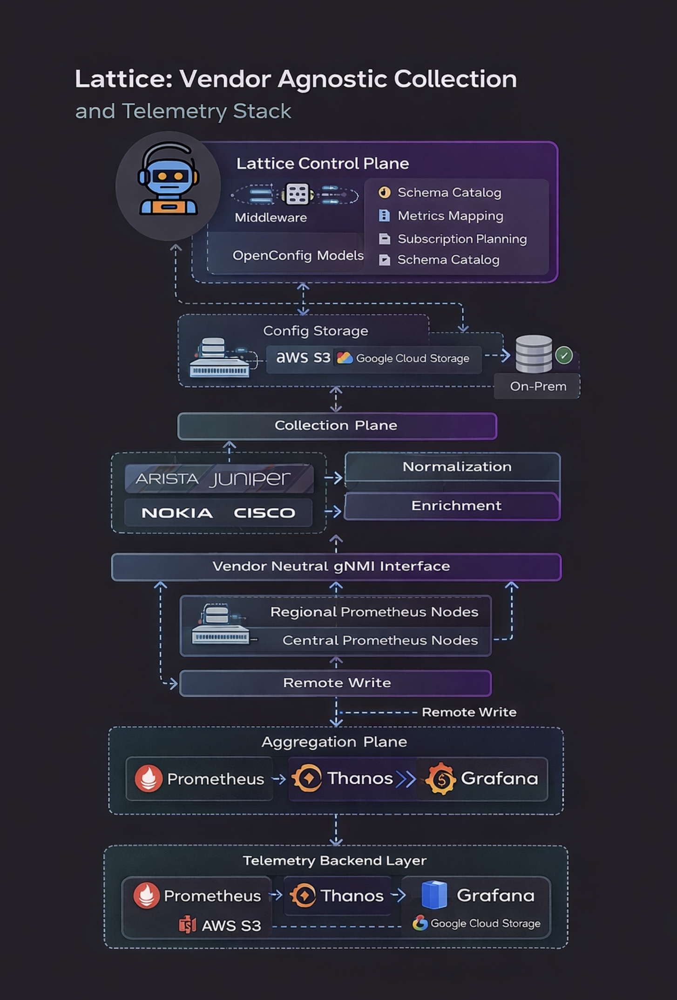

# Lattice

Agentic AI powered data center orchestration control plane for CLOS fabrics.

Lattice ingests declarative intent and inventory, validates topology and external connectivity,
builds deterministic change plans, evaluates risk through an MCP guard plane,
applies model driven configuration via gNMI, verifies state, and rolls back on failure.

This is not CLI automation.
This is a policy enforced orchestration boundary.

---

## Architecture

  

---

## System Overview

Lattice is composed of the following layers:

### Intent Layer
- Static JSON intent source
- Pluggable intent ingestion interface
- Structured change definitions
- Scoped change sets

### Inventory Layer
- Static JSON inventory
- Git backed inventory
- NetBox plugin
- Vendor agnostic device modeling
- CLOS role classification
- Capability modeling

### Planning Layer
- Deterministic planner
- ChangePlan construction
- Protocol specific modeling
- CLOS topology validation
- External connectivity policy enforcement
- Two tier and three tier capacity modeling

### Guard Layer (MCP Control Plane)
- Versioned request schema
- Versioned response schema
- HMAC request signing
- Timestamp validation
- Nonce replay protection
- Authorization token enforcement
- Deterministic risk scoring
- Approval gating
- Structured JSON audit logging

### Execution Layer
- PlanExecutor abstraction
- In memory executor for testing
- Model driven gNMI execution
- Verification engine
- Rollback specification
- Guard enforced execution modes

### Agent Layer
- AgentRunner orchestration loop
- Apply, simulate, and dry run modes
- Policy gate enforcement
- Optional MCP integration
- Intent lifecycle management foundation

---

## CLOS Aware Fabric Model

Lattice understands and validates:

- Leaf
- Spine
- Super spine
- Edge leaf
- Dual connected leaf
- Border leaf
- Border pod

Topology validation enforces:

- Minimum uplink constraints
- Spine symmetry
- Super spine adjacency rules
- Border isolation patterns
- External connectivity symmetry

---

## Capacity Modeling

Two tier CLOS:
